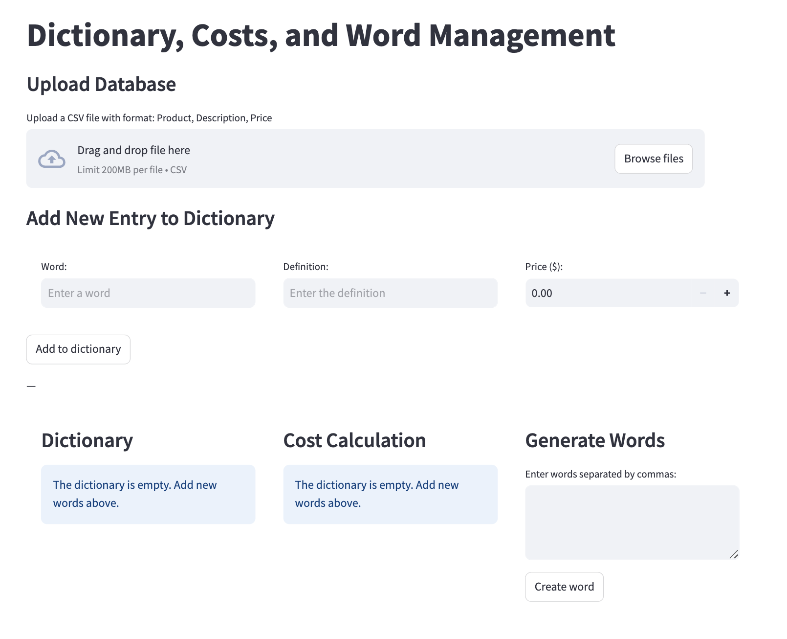

# Interactive Dictionary and Cost Management App

 <br>

This repository contains a Streamlit application for managing a dictionary of products, including their definitions and prices. The application allows users to upload a CSV file, add new entries, calculate costs, and generate words based on user input. The project is containerized using Docker for easy deployment.

## Project Structure

The repository includes the following files in the `Interactive-dictionary` folder:

- **Dockerfile**: Contains instructions for building the Docker image for the application.
- **docker-compose.yml**: Defines services and configurations for running the application with Docker Compose.
- **app.py**: The main application file where the Streamlit app is defined.
- **utilities.py**: Contains utility functions, including the `nth_letter_word` function used in the app.
- **requirements.txt**: Lists the Python dependencies required to run the application.
- **activities.py**: A simplified version of the solution is provided in this file.
- **data/ejemplo.csv**: A sample CSV file located in the `data` folder that can be used for testing the application.

## Features

- **Upload Database**: Users can upload a CSV file containing product information (Product, Description, Price).
- **Add New Entries**: Users can add new words, definitions, and prices to the dictionary.
- **Cost Calculation**: The app allows users to select products and calculate the total cost including tax.
- **Word Generation**: Users can input words to generate new ones based on specified criteria.

## Getting Started

To run this application locally using Docker, follow these steps:

### 1. Clone the Repository

If you haven't already cloned this repository, do so with:

```bash
git clone https://github.com/CCOcampo/Python-Utility-Suite.git
cd Python-Utility-Suite/Interactive-dictionary
```

### 2. Build the Docker Image

Build the Docker image using the following command:

```bash
docker build -t my-streamlit-app .
```

### 3. Run the Docker Container

After building the image, run it using:

```bash
docker run -p 8501:8501 my-streamlit-app
```

### 4. Access the Application

Once the container is running, open your web browser and navigate to:

```bash
http://localhost:8501
```

You should see your Streamlit application running.

## Testing with Sample Data

A sample CSV file `example.csv` is included in the data folder. You can use this file to test the application's functionality by uploading it through the provided interface.

## Conclusion

This project serves as a foundational template for developing and deploying applications that utilize data analysis in Python. The use of Docker simplifies deployment and ensures consistency across different environments.
Feel free to explore, modify, and extend this application as needed!
