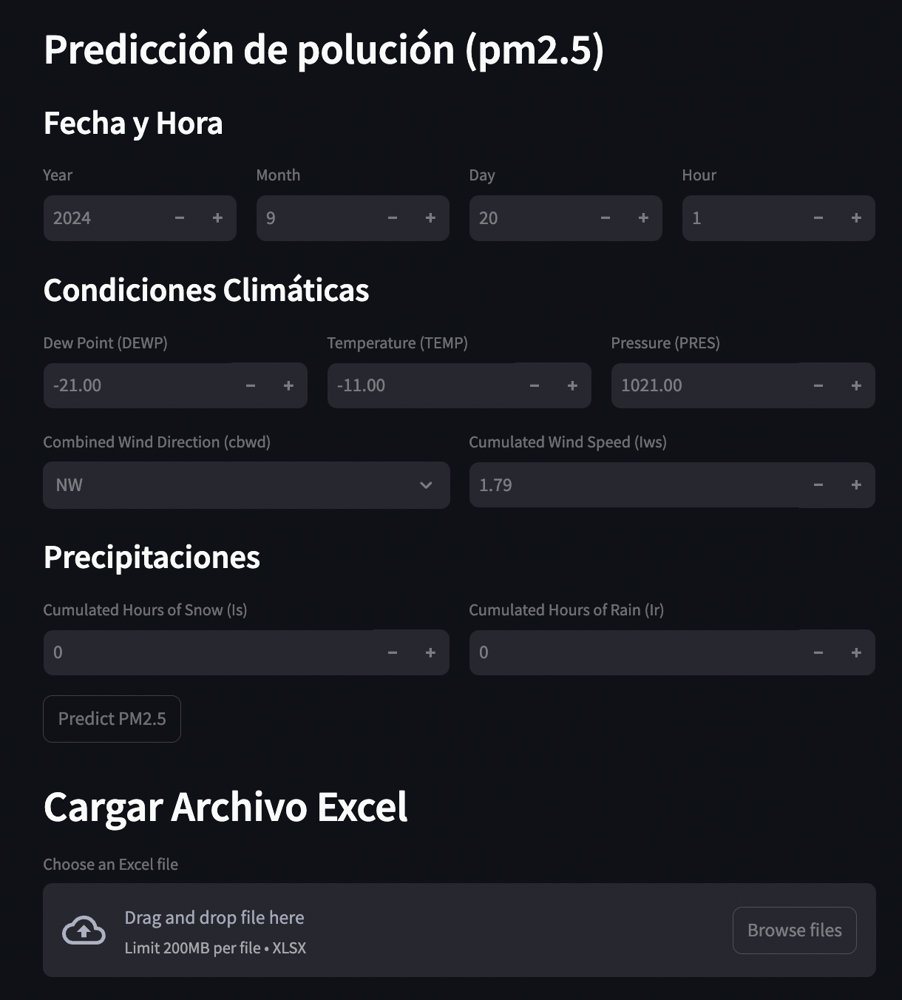
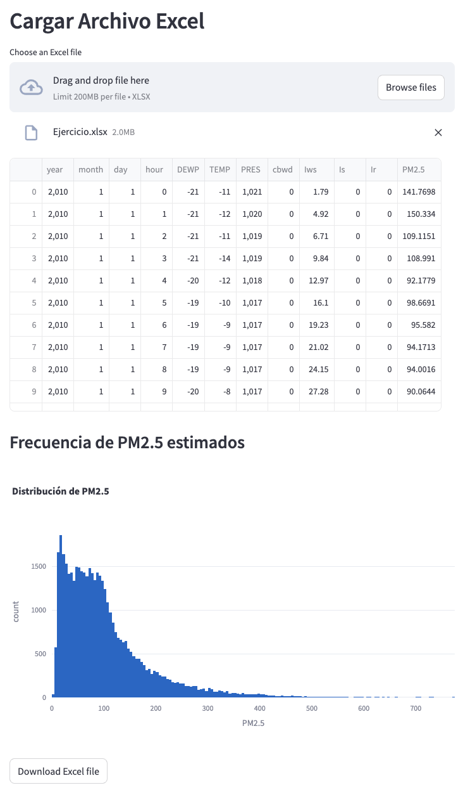

# Proyecto de Predicción de Polución

  

Este proyecto tiene como objetivo predecir los niveles de polución del aire utilizando técnicas avanzadas de análisis y modelado de datos. Empleando un conjunto de datos históricos sobre la calidad del aire, se desarrollaron modelos de machine learning y deep learning para realizar las predicciones.

## Objetivos del Proyecto

- **Análisis Exploratorio de Datos**: Comprender la estructura y características del conjunto de datos.
- **Preprocesamiento de Datos**: Limpiar y preparar los datos para el modelado.
- **Modelado Predictivo**: Construir y entrenar modelos de regresión y redes neuronales.
- **Evaluación de Modelos**: Evaluar el rendimiento de los modelos utilizando métricas estándar.
- **Visualización de Resultados**: Crear visualizaciones para interpretar y comunicar los resultados.

## Interfaz de la Aplicación

Una vez que corras el código `main.ipynb` para obtener el archivo `.pkl`, la interfaz de la aplicación desarrollada en Streamlit te permite editar los valores que están por defecto en cada casilla para estimar el nivel de polución. Además, tienes la opción de subir un archivo Excel con una lista de valores, y el resultado será un archivo Excel que se visualiza en la interfaz y también se puede exportar si lo deseas. La aplicación también muestra un histograma de los resultados obtenidos de PM2.5 de la lista importada.

  
